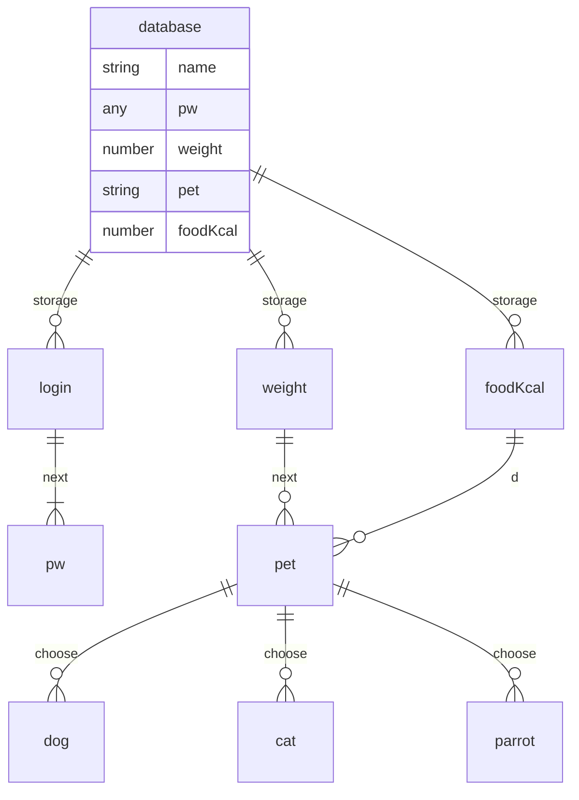

# Expo Router Example

Use [`expo-router`](https://expo.github.io/router) to build native navigation using files in the `app/` directory.

## 🚀 How to use

```sh
npx create-expo-app -e with-router
```

## 📝 Notes

- [Expo Router: Docs](https://expo.github.io/router)
- [Expo Router: Repo](https://github.com/expo/router)

### er diagram
